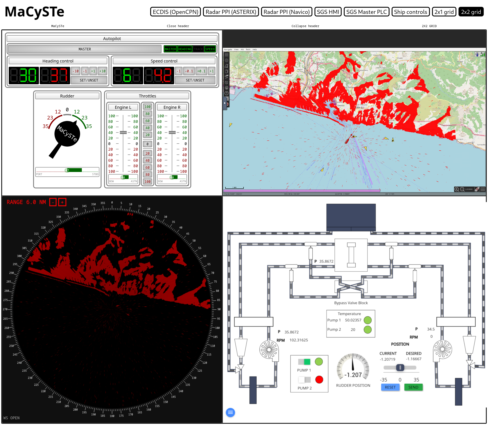

# Introduction

Welcome to the documentation of the Maritime Cyber Security TEstbed (MaCySTe), a toolkit for cyber security research on ships.



## Reference paper

```bibtex
@article{Longo2023,
  doi = {10.1016/j.softx.2023.101426},
  url = {https://doi.org/10.1016/j.softx.2023.101426},
  year = {2023},
  month = jul,
  publisher = {Elsevier {BV}},
  volume = {23},
  pages = {101426},
  author = {Giacomo Longo and Alessandro Orlich and Stefano Musante and Alessio Merlo and Enrico Russo},
  title = {{MaCySTe}: A virtual testbed for maritime cybersecurity},
  journal = {{SoftwareX}}
}
```

## Authors

MaCySTe has been developed in the University of Genova by Stefano Musante as his master thesis project.

Such work has then been extended by Giacomo Longo, Alessandro Orlich, and Enrico Russo in order to be a usable tool for the scientific community.

### Contact details

Giacomo, Alessandro, and Enrico: _name.surname_@dibris.unige.it
