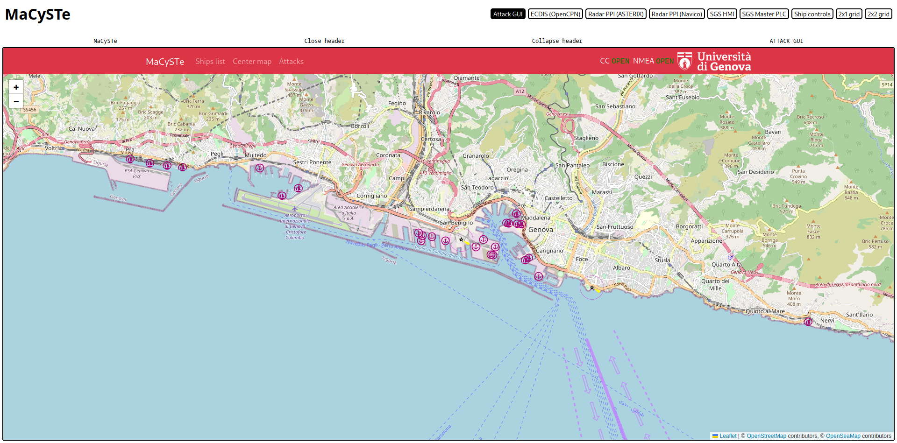
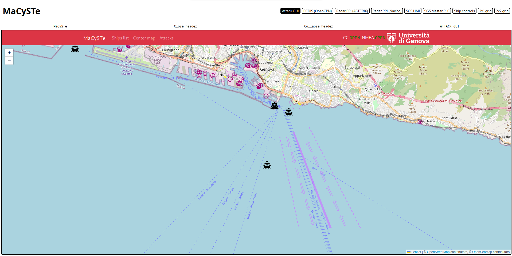
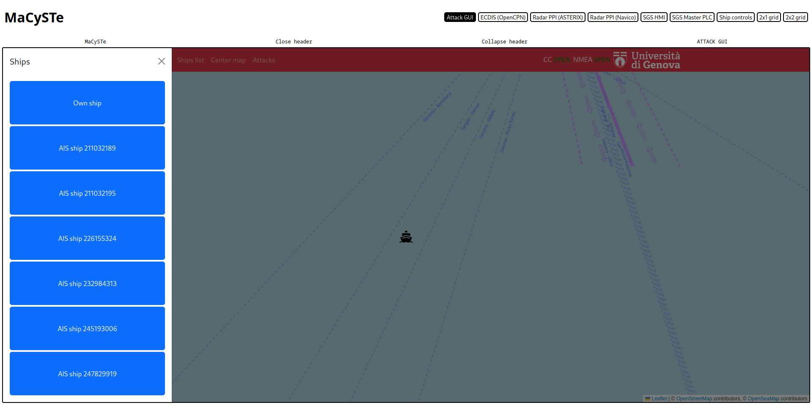
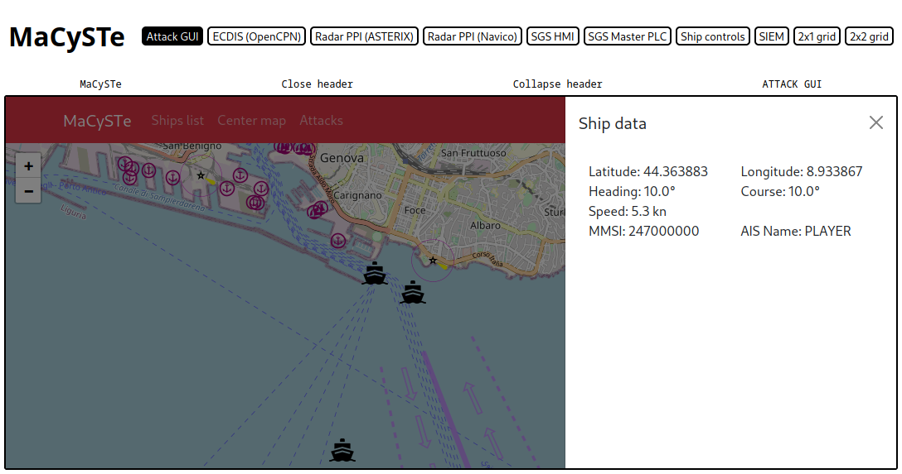
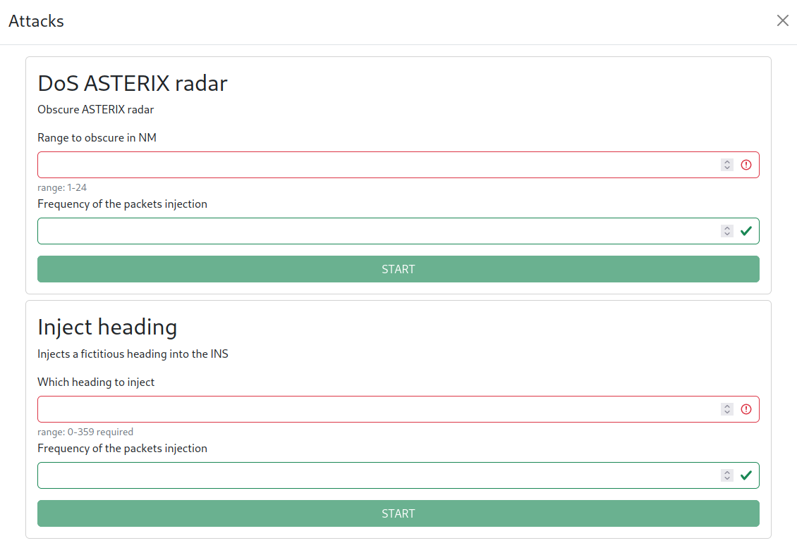

# Attack GUI

MaCySTe includes a powerful and modular attack GUI, allowing the user to perform attacks in a point and click fashion.

To access it, from the [GUI home](./gui-home.md) click on _Attack GUI_ and you will be presented with the interface



If the connection to the command and control server is established (indicated by the two green indicators in the top-right corner) you will soon see ship shapes starting to appear on the map



From this view, you can click on _Ships list_ to see which ships have been found, click on the button to center the map on it



Click on a ship icon on the map to see its reported information



Click on _Attacks_ to bring up the attacks list and run them



## Automatic GUI generation

The attacks interface is actually dynamically generated by asking the malware via [RPC](./malware.md#attack-json-rpc-api) for its available attacks.

The `attack_inventory` call will generate a response containing elements like

```json
{
    "name": "dos_radar",
    "ui_name": "DoS ASTERIX radar",
    "description": "Obscure ASTERIX radar",
    "parameters": [
        {
            "name": "range_nm",
            "description": "Range to obscure in NM",
            "required": false,
            "type": "number",
            "default": 12,
            "min": 1,
            "max": 24
        },
        {
            "name": "injection_hz",
            "description": "Frequency of the packets injection",
            "required": false,
            "type": "number",
            "default": 1
        }
    ]
}
```

Each of the parameters shown will be automatically converted into GUI elements and client-side validated, allowing you to easily add your own attacks simply by adding them to the malware with the GUI taken care of automatically.

Currently only a numeric widget is made available but in future releases of MaCySTe we will add more specific panel elements.
