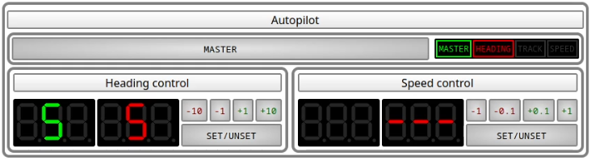
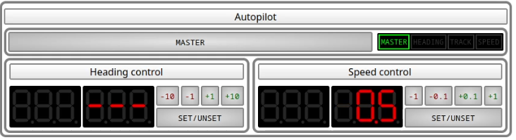

# Autopilot

MaCySTe bundles a tri-function autopilot allowing the automatic control of a ship.

Its interface can be accessed from the [instruments GUI](./instruments.md).

These three functions are

- [Heading control](#heading-control)
- [Track control](#track-control)
- [Speed control](#speed-control)

## Turning on the autopilot

The autopilot has a master switch, allowing you to completely disable it.

Whenever the autopilot is disabled, its master light does not illuminate and the bottom displays stay dark.

## Heading control

Heading control will keep the boat pointing at a particular heading.

To use it, prepare with the buttons the heading you wish to hold.

then, press the _set/unset_ button

### Warnings

If heading control is enabled but some waypoint source is offering a route suitable for [track control](#track-control) applications, the track control light will flash in orange indicating that a switchover is possible

### Errors

If heading control is enabled but the autopilot cannot determine the current heading, the heading control light will flash in red indicating a failure

## Track control

Track control is similar to heading control but instead of holding an heading set by the autopilot, it will hold a trajectory sent by some other instrument (typically an [ECDIS](./ecdis.md)).

In MaCySTe track control allows to automatically follow a given route without human intervention.

To setup a route, open the ECDIS and find a spot you desire to reach, then right click and press _Navigate To Here_

If you did everything correctly, a new window should appear indicating that OpenCPN has now set the route and is navigating towards the waypoint

In the autopilot window you will now see the track light illuminated, indicating the track control mode activation

Track mode can be disabled, even when a track is available by:

- [Shutting down the autopilot](#turning-on-the-autopilot)
- [Enabling heading control](#heading-control)

## Speed control

Speed control will keep the boat at a set speed.

To use it, prepare with the buttons the speed you wish to hold.

then, press the _set/unset_ button

### Errors

If speed control is enabled but the autopilot cannot determine the current speed, the speed control light will flash in red indicating a failure

## Technical details

MaCySTe autopilot implements an extremely simple control logic known as a progressive-integral controller.

For a given setpoint \\(x^* \\) and error with respect to the current state \\(e = x^* - x \\) the control action is calculated as
\\[ K_p \cdot e + K_i \cdot \int_t e \\] where \\( K_p \\) and \\( K_i \\) are coefficients.

This autopilot also implements two anti-windup techniques:

- The integral component is enabled only when \\( e \\) is small
- The integral component is reset on overshoot

The autopilot listens on the bridge network to reconstruct the ship state and its taken decisions are then actuated in the network by commanding via ModBus the master PLC of the [steering gear system](./steering-gear-system.md) or the [engine PLCs](./propulsion-system.md).
