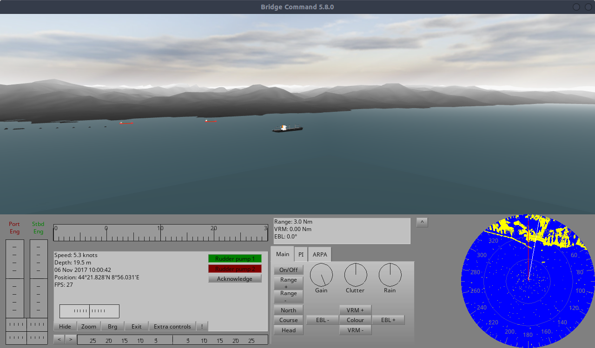

# Bridge Command

Inside of MaCySTe, the bridge simulator is another project: _Bridge Command_.

Bridge Command is an open source and liberally licensed ship simulator authored by James Packer.

Please refer to its documentation for more information.

## Modifications

MaCySTe heavily modified Bridge Command to integrate it (patches are in `src/flatpacks/bridgecommand/bc-patches` relative to repo root) adding the following alterations:

- We added AIS NMEA sentences (VDM, VDO) output
- We added the VTG NMEA sentence output
- We added the VHW NMEA sentence output
- We allow to automatically skip the loading pause and preseed the scenario by setting the `SKIP_PAUSE` and `SCENARIO_NAME` variables
- We added integration with the [NATS.c](https://github.com/nats-io/nats.c) library
- We added a variable `NMEA_TO_NATS` which once set will send every NMEA sentence to NATS
- We added a variable `SKIP_MENU` to skip the initial Bridge Command pause
- We added an exporter for raw radar image data to NATS KV store
- We added an integration for getting the rudder position from NATS
- We added an integration for getting the engine telegraph positions from NATS
- We added a way for disabling all rendering code in Bridge Command by setting the `HEADLESS` environment variable

## Headless mode

Once the headless mode is enabled, Bridge Command will run skipping all rendering code, this can greatly improve the performance of MaCySTe whenever no rendering device is available.

On Linux, you can take a look at Bridge Command outputs in the command line, if you see _llvmpipe_ being mentioned then Bridge Command is using software rendering and you should use its headless mode.

