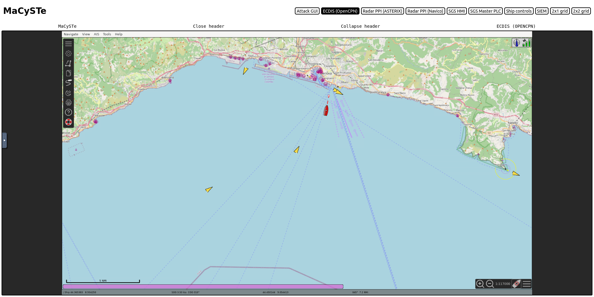

# ECDIS

The Electronic Chart Display and Information System used by MaCySTe is the well-known OpenCPN project.

We invite users to refer to its documentation for more information on its usage and powerful features.

Please refer to the [autopilot track control section](./autopilot.md#track-control) for more informations on how to use it for waypoint to waypoint automatic navigation.

We leverage it as-is with the only addition of nautical charts for the Genoa scenario.

