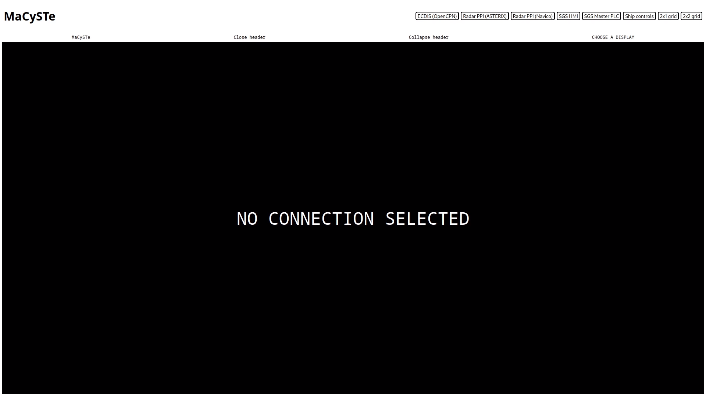
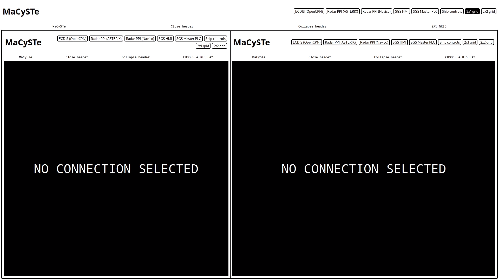
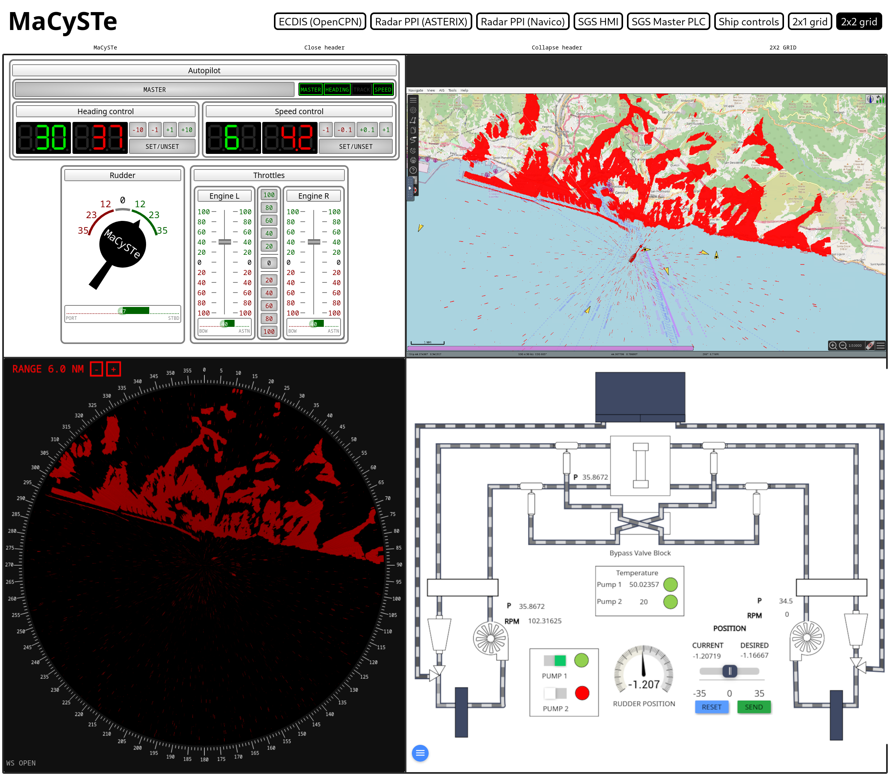
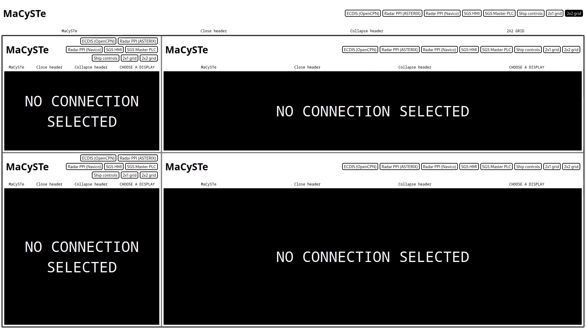
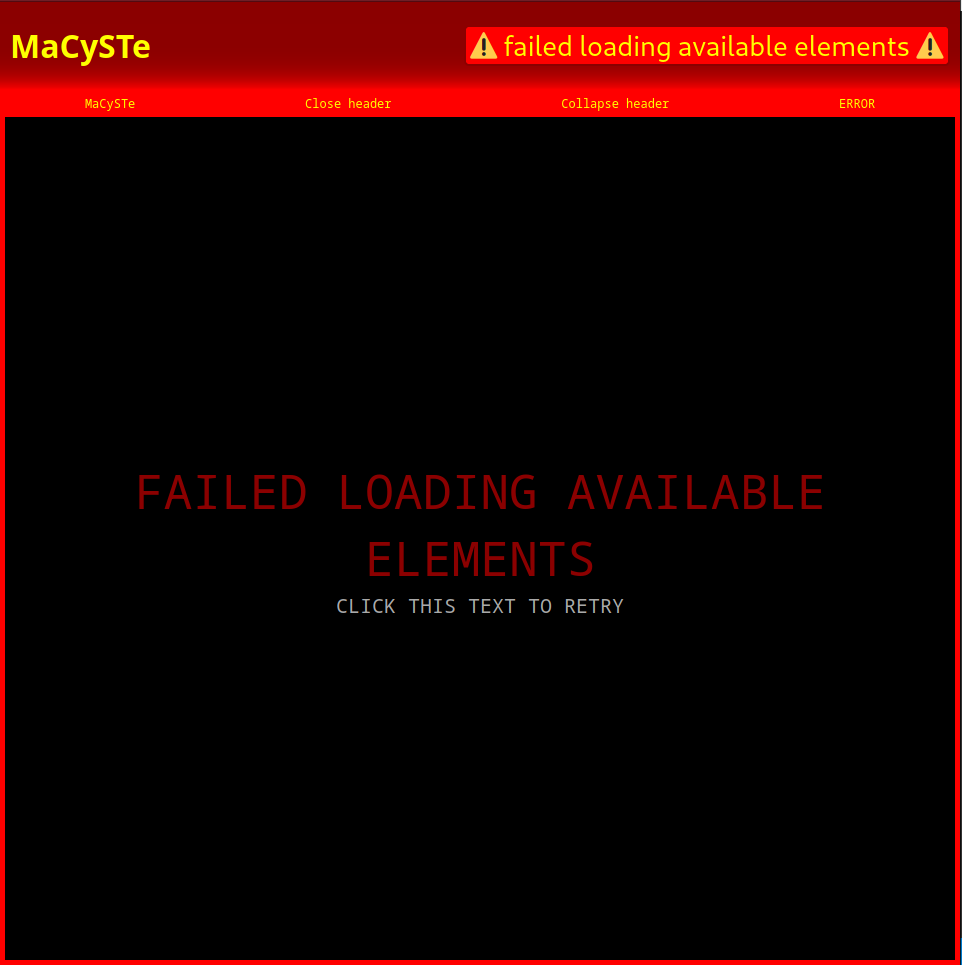

# GUI home

MaCySTe bundles inside of it a lot of graphical components accessible by the browser.

Given the dynamic nature of both the scenarios and their IP allocations, keeping stable identities for each of the components would have been a cumbersome process.

To streamline it, we provide a centralized hub which allows access to every interactible component in a simplified fashion.

## Usage

Once opened, the GUI will [download from the server a list of available visualizations to display](#download-of-available-visualizations) and wait for user input

The user then can select which display to show by clicking on it.

Once opened, the GUI header can be either reduced in size by clicking on _Collapse header_ or entirely removed by clicking on _Close header_

### 2x1 grid

By clicking on the __2x1 grid__ on the top of the screen, the MaCySTe GUI can be split into two resizable quadrants.

Each of the diplays inside of this side by side view can be operated as an indipendent GUI instance.

To move the center divisor click and drag it.

### 2x2 grid

By clicking on the __2x2 grid__ button on the top of the screen, the MaCySTe GUI can be split into four resizable quadrants.

Each of the quadrants is a new MaCySTe GUI instance, allowing also deeply nested layouts.

To resize the quadrants, click and drag the frame separator.

## Errors

In case of errors while loading the available GUI elements, an error interface such as the one below will be shown.

## Download of available visualizations

In order to discover the available elements, the GUI will request the list of server environment variables at `/config/env`.

Then, for each variable named `MENU_<x>_TEXT` it will request from the server:

- The text to display on the button at `/config/env/MENU_<x>_TEXT`
- The tip to display in the interface at `/config/env/MENU_<x>_TIP`
  - The tip has to be a space separated `key=value` list which will be rendered as columns containing `key: value`
- The URL of the element at `/config/env/MENU_<x>_URL`