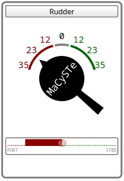

# Helm

Within the instruments GUI of MaCySTE, there is an helm which can be acted on by either dragging it or clicking directly on the dial numbers.

Below, a colored bar will indicate the indicated rudder desired attitude.

