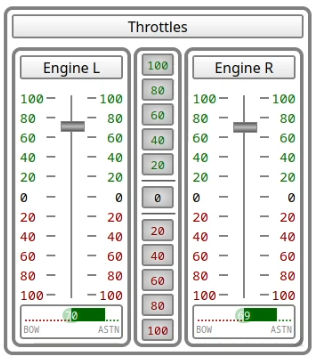

# Telegraphs

The telegraphs within the instruments GUI allow to control the engine power in MaCySTe.

Engines can either be governed indipendently or synced together.

To act on them indipendently, drag the silver handle upwards for ahead and downwards for astern. Alternatively, click on the numbers to the side of the handle to instantly set the desired output (e.g. click on the green 100 to perform a slam start).

Whenever you wish to sync the throttles, click on the center buttons to set both telegraphs at the same time.

A colored bar below each engine will indicate the current telegraph position.

