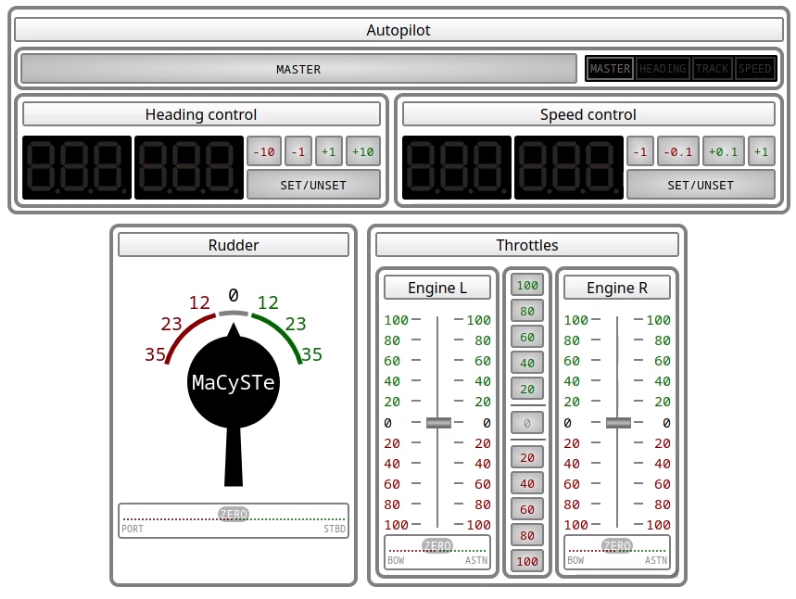

# GUI instruments

MaCySTe bundles a in its GUI an instrument panel, allowing you to control the ship and its systems.

Such instrument panel can be accessed from the MaCySTe [GUI home](./gui-home.md).

It bundles together three different control panels:

- An [autopilot control panel](./instruments-autopilot.md)
- An [helm](./instruments-rudder.md)
- Two [engine order telegraphs](./instruments-telegraphs.md)

Whenever more than one instance is open (e.g. in two separate browser windows) they will get synced together in real time, allowing you to control MaCySTe from multiple displays.

Technically, each and every move made inside of these simulated instruments is reflected inside of MaCySTe by interacting with the [message queue](./nats.md) over a WebSocket connection.
