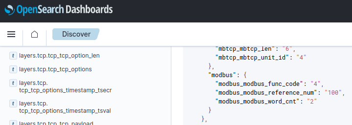

# ModBus probe

The ModBus probe installed by the SIEM addon takes place as a container colocated with the PLC listening to the network interface traffic.

This architecture resembles traditional Intrusion Detection Systems way of installation in which the IDS listens for every packet belonging to a particular network card.

Each ModBus packet will get sent to OpenSearch.

