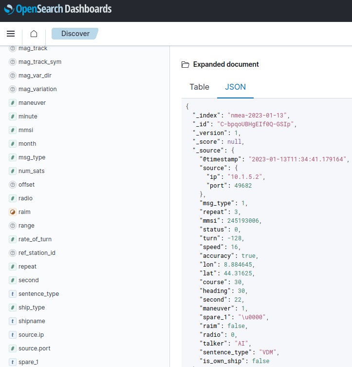

# NMEA probe

The NMEA probe will listen for the NMEA sentences being broadcasted in the INS network.

Each NMEA sentence will be parsed, converted into a structured format and sent to OpenSearch for storage.

## Configuration

The probe takes the following parameters from its environment

|Name|Description|
|---|---|
|`OPENSEARCH_URL`|URL of the OpenSearch server|
|`NMEA_HOST`|Address on which NMEA is multicasted|
|`NMEA_PORT`|Port on which NMEA is multicasted|
