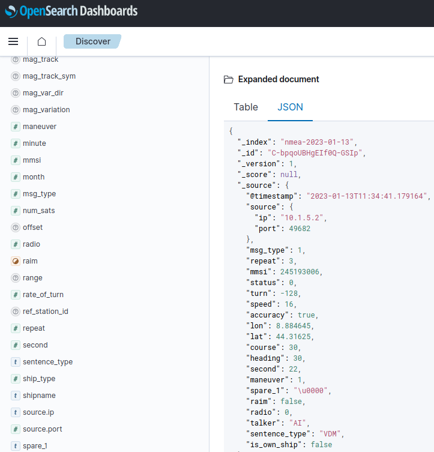

# OpenSearch

MaCySTe integrates with OpenSearch, automatically preseeding its dashboards server to display the data gathered from the probes.

Once deployed, the dashboard can be accessed from the [GUI](./gui-home.md) and clicking on the `SIEM` button.

The default user and password are `admin`

**Do not expose the MaCySTe database to the outside without changing these credentials first**

In order to explore the data, select _Discover_ from the sidebar and select the index pattern in the top-left corner.

By default you will be able to inspect ModBus traffic

And NMEA traffic

