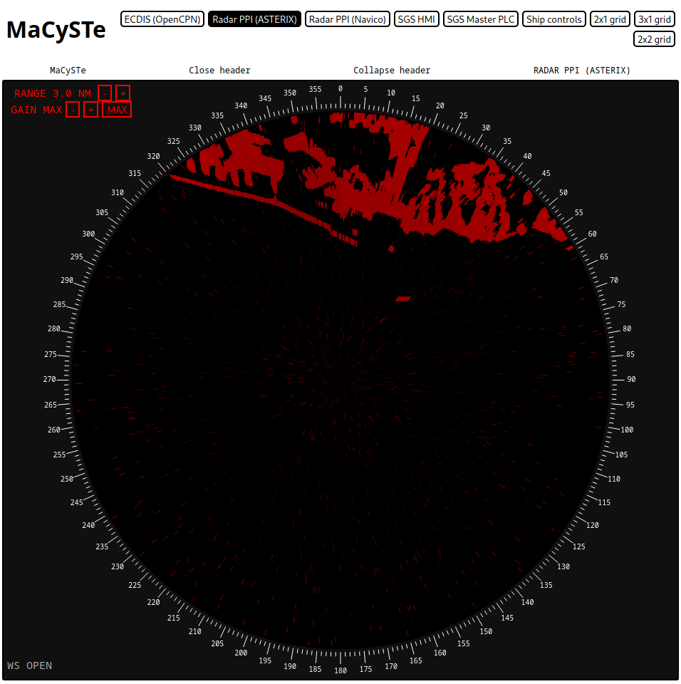

# ASTERIX PPI

MaCySTe includes an asterix PPI (plan position indicator) under the form of web application.

The application listens on one websocket used to receive radar image under the form of ASTERIX CAT240 packets, and leverages NATS to publish commands to change the display radar range.

These two can be configured as environmental variables of the `spa_hoster`, namely `ASTERIX_WS_URL` and `NATS_WS_URL`.

The radar picture is displayed in heading up orientation.

The radar gain can be changed with the `+` and `-` buttons or set to maximum contrast mode by pressing `MAX`

