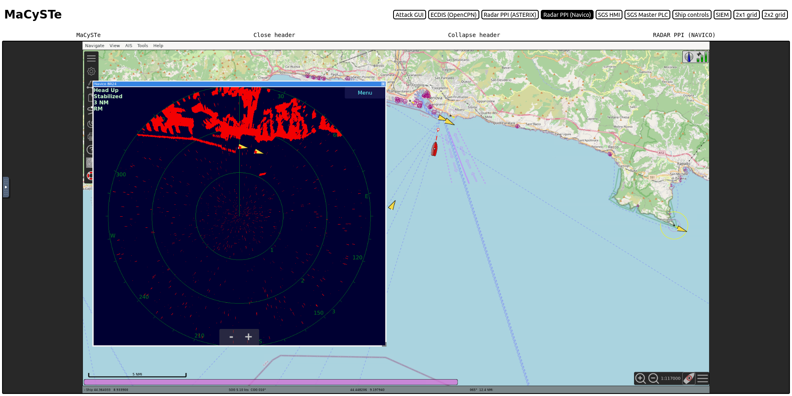
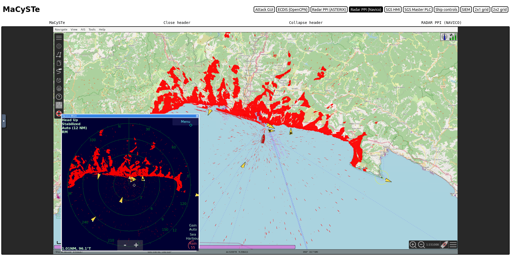

# OpenCPN PPI

MaCySTe includes a PPI for Navico BR24, thanks to [radar_pi - Radar Plugin for OpenCPN](https://github.com/opencpn-radar-pi/radar_pi).  
The PPI supports both Head up and North up orientation and changes of the display ranges.

The plugin supports the radar overlay onto the map, to activate it press `Menu > Window > Radar Overlay On`

