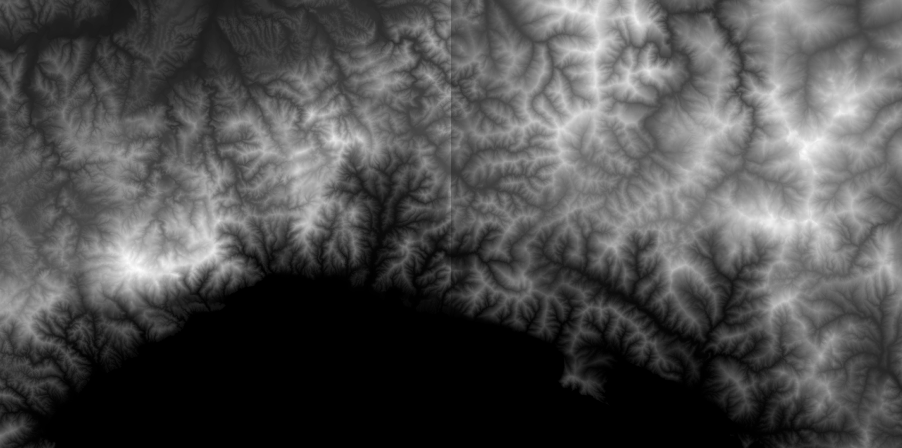
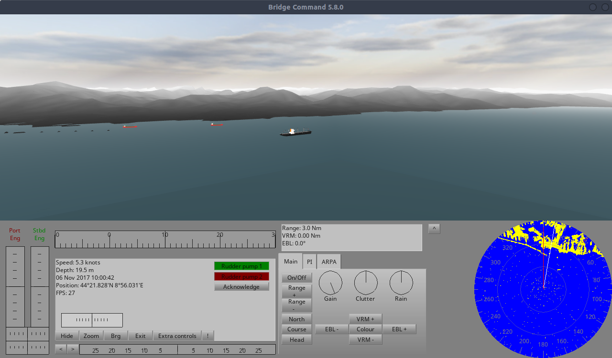
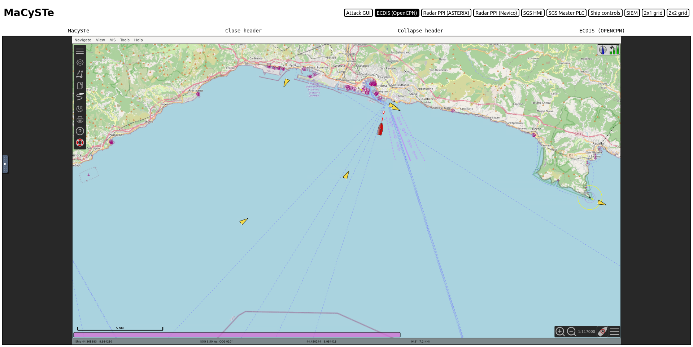

# Genova harbor

We added to the ship simulator a scenario set on the _Ligurian Sea_ and the _Port of Genoa_ (Coordinates:  44◦ 24' 10'' N, 8◦ 55' 0'' E).
To create the 3D model we used the heightmap tiles made available by _the Italian National Institute of Geophysics and Volcanology_ [[1]](https://tinitaly.pi.ingv.it/Download_Area1_1.html).

