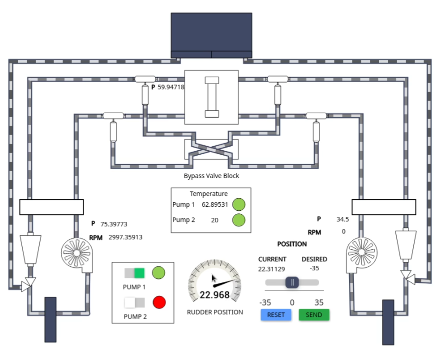
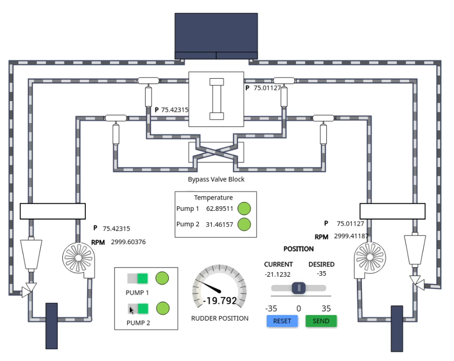
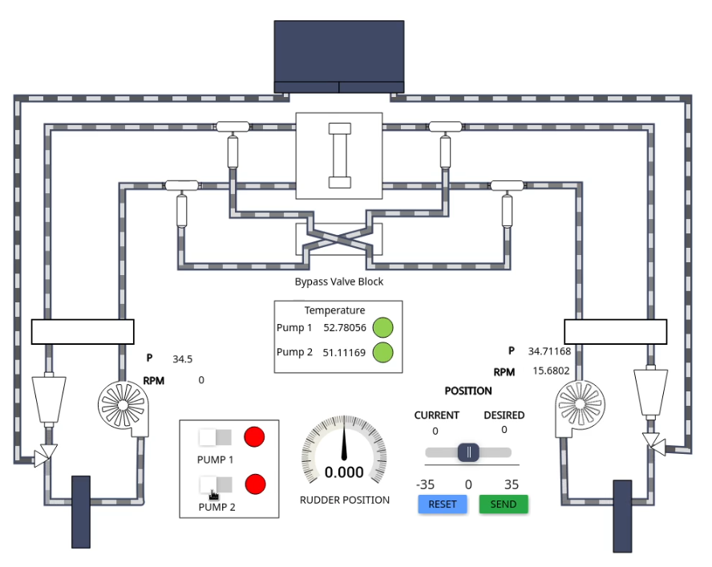

# Steering Gear System

MaCySTe integrates a simulated quad ram steering gear system comprised of 6 PLCs and an external physics simulator.

Such steering gear system integrates two separate indipendent hydraulic systems operating each 1 pump, 1 oil tank, and two counteracting rams. Its structure and performance characteristics meet the standards set in the SOLAS regulations for steering gear systems.

In the default configuration, the SGS runs in a single pump configuration with the master PLC receiving the desired rudder angle from the helm via ModBus and actuating the PLCs under it to actuate the steering rams.

If desired, from the _SGS HMI_ of the [GUI](./gui-home.md) it is possible to manually dial in a new rudder position or to turn on a secondary pump

If both pumps are turned off, the rudder will be left in a neutral position, unable to move

The master PLC will also automatically start (unless it has been forced into manual mode) the secondary power unit whenever the expansion tank of the respective side activates its low level alarm in order to avoid loss of steering capability.

Please be aware that like in the real system, repeated full deflection of the rudder will overheat the hydraulic oil in the circuit, triggering alarms. To reduce overheating it might be needed to turn on both pumps during these high stress events.
