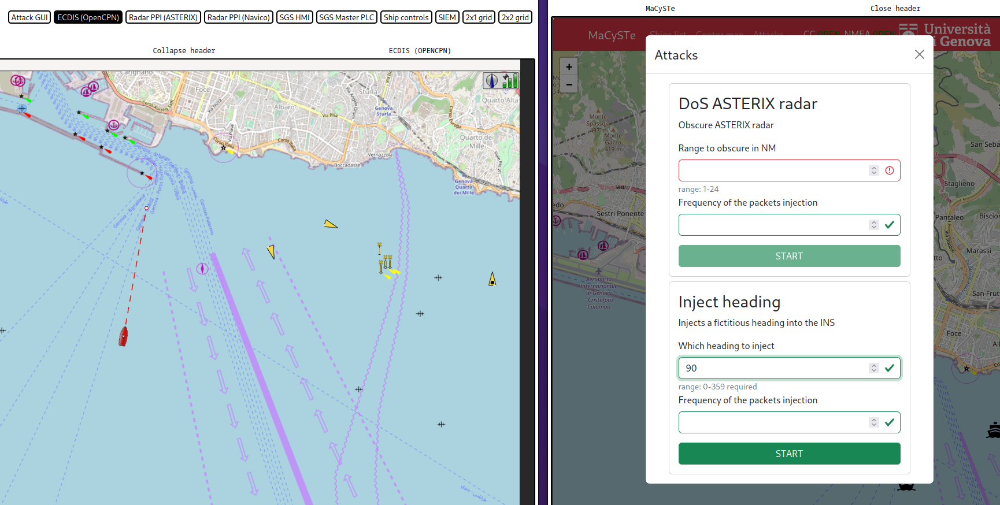
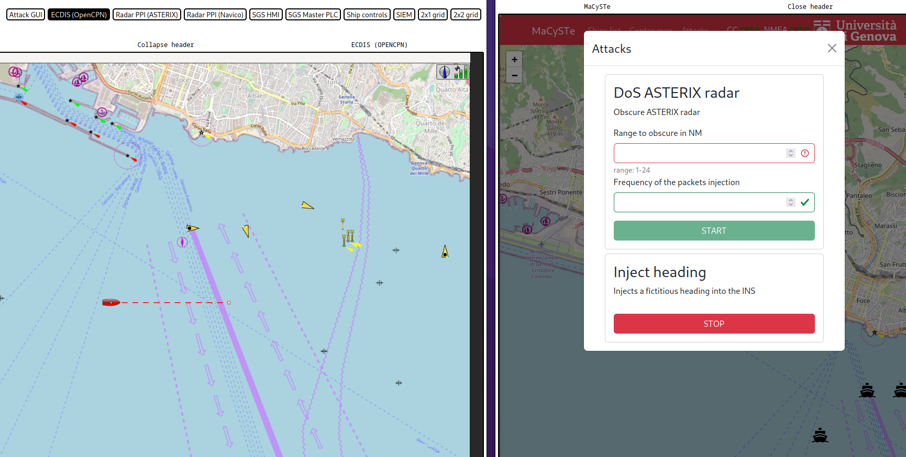
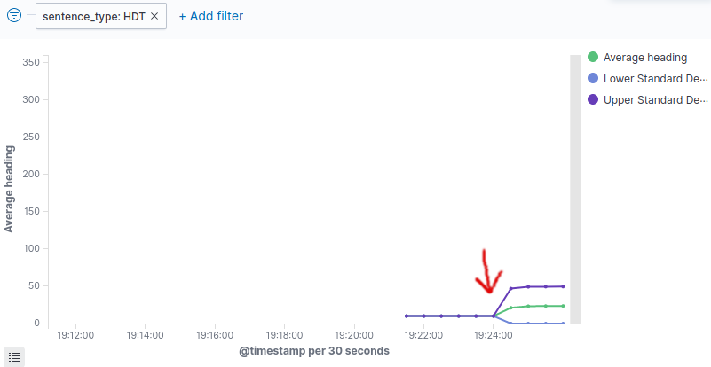

# Attacking the Integrated Navigation System

MaCySTe can perform attacks targeted at the INS instruments.

Bundled with MaCySTe there is a simple attack injecting a fictitious heading value into the navigation network.

To use it, ensure to have deployed a scenario containing the malware (such as `attacker_siem`) and access the [attacker GUI](../reference/attack-gui.md) from the [MaCySTE GUI](../reference/gui-home.md).

Once there, click on attacks and input the heading you wish to inject.

After starting the attack, you will see on other instruments such as the ECDIS a modified heading.

You will also be able to detect it within the SIEM.

