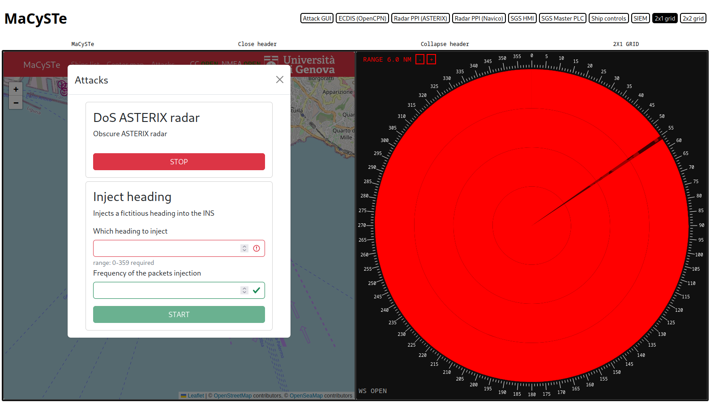

# Attacking the radar

In MaCySTe we provide a sample implementation of the ASTERIX DoS attack on radar systems described in:

```bibtex
@article{Longo2023,
  doi = {10.1109/tifs.2023.3282132},
  url = {https://doi.org/10.1109/tifs.2023.3282132},
  year = {2023},
  publisher = {Institute of Electrical and Electronics Engineers ({IEEE})},
  pages = {1--1},
  author = {Giacomo Longo and Enrico Russo and Alessandro Armando and Alessio Merlo},
  title = {Attacking (and Defending) the Maritime Radar System},
  journal = {{IEEE} Transactions on Information Forensics and Security}
}
```

To use it, ensure to have deployed a scenario containing the malware (such as `attacker_siem`) and access the [attacker GUI](../reference/attack-gui.md) from the [MaCySTE GUI](../reference/gui-home.md).

Once there, click on attacks, select a range and start the DoS.

The result, as you can see below will be a packet obscuring the entire PPI.

