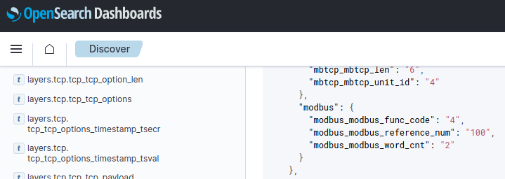

# Industrial Control System data

Industrial Control System data in MaCySTe uses the ModBus protocol over TCP on the standard port 502.

For the core scenario, the helm, engine telegraphs, and internal Steering Gear Control System elements can be instrumented by leveraging a [custom ModBus probe](../reference/modbus-probe.md).

To look at the data, ensure you have run MaCySTe with a scenario integrating [OpenSearch](../reference/opensearch.md) and the [probe](../reference/modbus-probe.md) (such as the built-in `siem` [one](../reference/addon-siem.md)).

Then, you will be able to access every ModBus packet in structured format by opening the [MaCySTe GUI](../reference/gui-home.md), clicking on _SIEM_, and taking a look from the _Discover_ page at messages present inside of the `modbus-*` OpenSearch indexes

