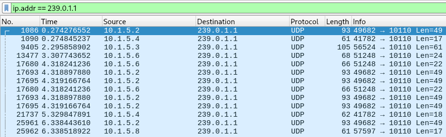

# INS NMEA data

On the INS network, multiple instruments and the ECDIS stream and receive NMEA data by leveraging multicast UDP datagrams.

For the default MaCySTe configuration, such traffic flows to and from the IPv4 multicast address `239.0.1.1` on port `10110`.

To acquire this traffic you can either:

1. Leverage the SIEM addon NMEA probe component to directly save every NMEA sentence in a structured format and query it
2. Leverage Wireshark on the host machine to inspect the network traffic
3. Add your own probe to the system by extending MaCySTe

## Structured output to OpenSearch

Ensure you have run MaCySTe with a scenario integrating OpenSearch (such as the built-in `siem` [one](../reference/addon-siem.md)).

Then, you will be able to access every NMEA sentence in structured format by opening the [MaCySTe GUI](../reference/gui-home.md), clicking on _SIEM_, and taking a look from the _Discover_ page at messages present inside of the `nmea-*` OpenSearch indexes

## Leveraging Wireshark

All of the flowing traffic can be inspected on the host by running Wireshark and listening to the special `any` interface

