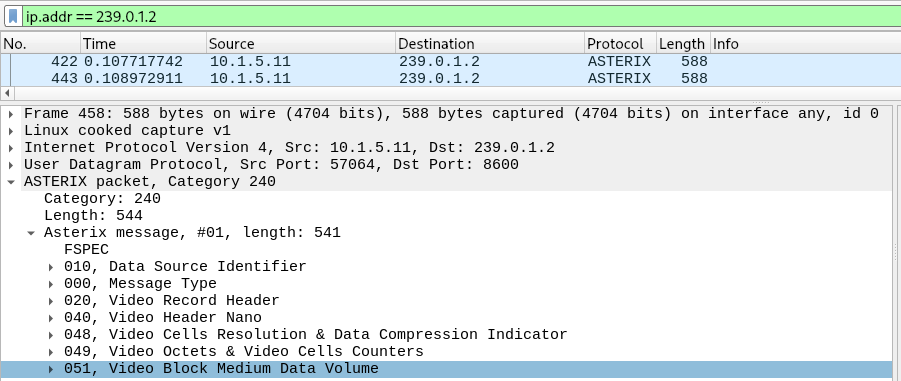

# ASTERIX data

ASTERIX is a protocol for radar data exchange, MaCySTe can generate it according to its standard profile (UAP).

In the default configuration MaCySTe will send ASTERIX video to address `239.0.1.2` on port `8600`

For more details on the protocol structure we refer the interested reader to section __2.E__ of [Attacking (and defending) the Maritime Radar System](https://doi.org/10.1109/tifs.2023.3282132)

```bibtex
@article{Longo2023,
  doi = {10.1109/tifs.2023.3282132},
  url = {https://doi.org/10.1109/tifs.2023.3282132},
  year = {2023},
  publisher = {Institute of Electrical and Electronics Engineers ({IEEE})},
  pages = {1--1},
  author = {Giacomo Longo and Enrico Russo and Alessandro Armando and Alessio Merlo},
  title = {Attacking (and Defending) the Maritime Radar System},
  journal = {{IEEE} Transactions on Information Forensics and Security}
}
```

As with NMEA, ASTERIX can be listened to and dissected with Wireshark.



You can visualize the ASTERIX data flow inside of the [PPI](../reference/ppi-asterix.md).
